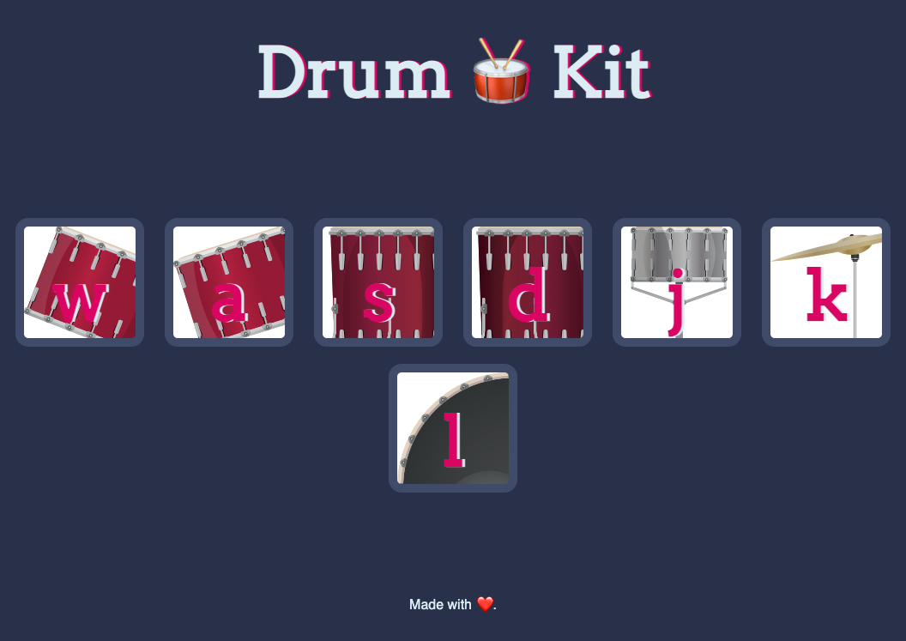

# DrumKit

In this project I practiced JS DOM manipulation. The CSS images and html are boilerplate from the course's resource with slight modification.

Usage:
- When the page is loaded, different drums can be played with a mouse-click or by pressing the related letter.
- A quick prompt appears on the button for a slight duration indicating the button was clicked or typed.

